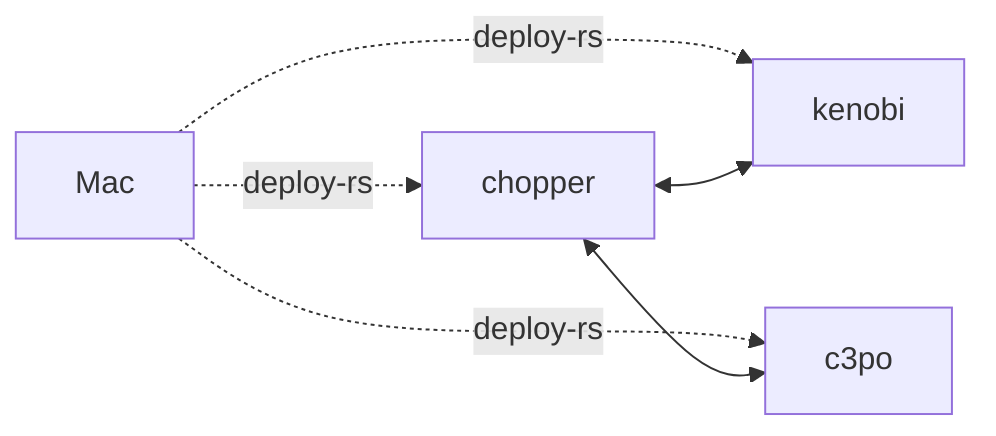
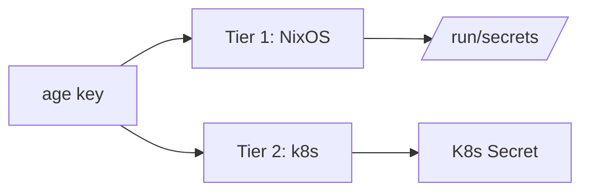
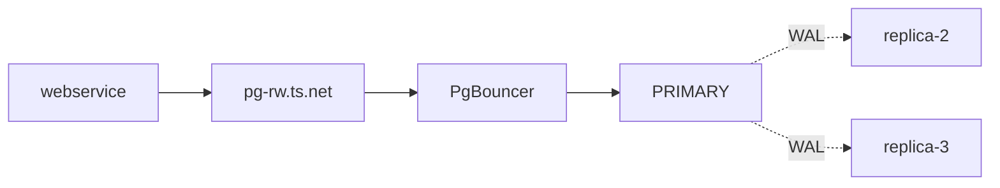
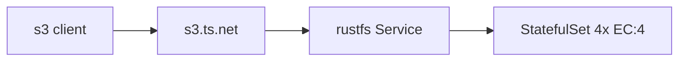
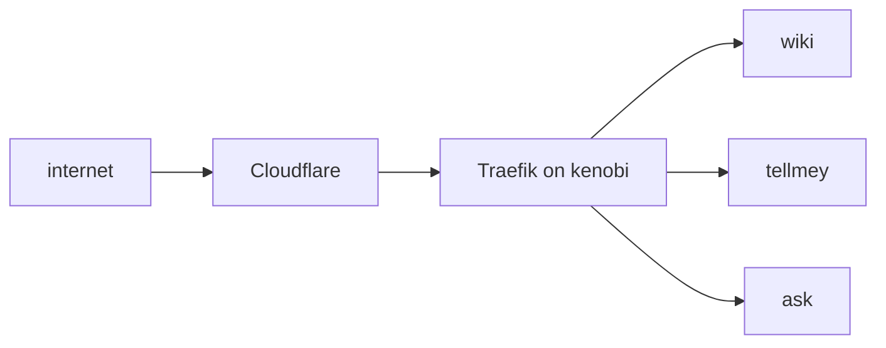

<!-- no_footer -->
<!-- jump_to_middle -->
<!-- alignment: center -->

**Vysakh Premkumar**

NIT Calicut · OHC Network  


<!-- end_slide -->

<!-- no_footer -->
<!-- jump_to_middle -->
<!-- alignment: center -->

**ONE REPO.**

<!-- pause -->

**3 MACHINES.**

<!-- pause -->

**2 X DATABASE.**

<!-- pause -->

**EVERY SECRET.**

<!-- new_line -->

from **`just deploy <host>`**

<!-- end_slide -->

WHAT WE'RE BUILDING
====================

<!-- alignment: center -->

**3** machines · **1** k3s cluster
**2** databases · **1** S3 store
**1** monitoring stack · **3** websites

<!-- pause -->

<!-- new_line -->

<!-- column_layout: [1, 1] -->

<!-- column: 0 -->

**THE JOURNEY**

<!-- incremental_lists: true -->

1. **Nix** — single source of truth
2. **ZFS** setup via disko
3. **Sops-nix** two-tier secrets
4. **Deploy-rs** from the Mac
5. **K3s** on Tailscale

<!-- incremental_lists: false -->

<!-- reset_layout -->

<!-- end_slide -->

<!-- no_footer -->
<!-- jump_to_middle -->
<!-- alignment: center -->

**PART 1**

**The Nix Layer**

_one repo, every machine_

<!-- end_slide -->

WHY A FLAKE?
============

> [!NOTE]
> A **flake** = pinned inputs (`flake.lock`)
> + declarative outputs (systems, pkgs, shells).

<!-- pause -->
<!-- speaker_note: |
show sudo apt update && Upgrade
<!-- new_line -->

**Three things change:**

<!-- incremental_lists: true -->

- **REPRODUCIBILITY** — every input is a
  _content hash_, not a tag.
- **COMPOSABILITY** — nixos, home, deploy,
  checks — all in one place.
- **DISCOVERABILITY** — `nix flake show`
  enumerates _every_ machine.

<!-- incremental_lists: false -->

<!-- pause -->

<!-- new_line -->

<!-- alignment: center -->

The flake is the **CONTRACT** between
my laptop and every server.

<!-- end_slide -->

`nix flake show`
=================

```bash
├── checks (deploy-rs)
├── darwinConfigurations
├── devShells.default
├── formatter (nixpkgs-fmt)
├── nixosConfigurations
│   ├── c3po
│   ├── chopper
│   ├── kenobi
│   └── vm-test
├── overlays.custom-packages
└── packages
    └── default, deploy-rs
```


<!-- end_slide -->

THE REPO
=========

```bash
.
├── flake.nix        # inputs + outputs
├── lib/             # mkHost / discover
├── hosts/           # ONE FOLDER PER MACHINE
│   ├── chopper/     # x86_64, k3s, ZFS
│   ├── kenobi/      # aarch64 cloud VM
│   └── c3po/        # x86_64 storage
```

<!-- pause -->

```bash
├── profiles/        # COMPOSABLE ROLES
│   ├── base.nix laptop.nix server.nix
│   └── k3s-node.nix zfs.nix
├── modules/services/
├── secrets/<host>/  # SOPS (Tier-1)
├── k8s/             # helmfile (Tier-2)
└── home/            # Home Manager
```


<!-- end_slide -->

HOSTS ARE JUST METADATA
========================

Adding a new machine = **one directory**.

<!-- new_line -->

```nix
# hosts/kenobi/metadata.nix
{
  hostname = "kenobi";
  system   = "aarch64-linux";
  hostId   = "a1b2c3d4";
  timezone = "Asia/Kolkata";
  type     = "nixos";
  roles    = [ "server" "k3s" "compute" ];
```

<!-- pause -->

```nix
  deploy = {
    host = "100.73.101.89"; # Tailscale
    sshUser     = "root";
    remoteBuild = true;     # ARM on target
  };
}
```


<!-- end_slide -->

THE FLEET
==========

| HOST    | ARCH    | ROLE        |
| ------- | ------- | ----------- |
| chopper | x86_64  | Control Plane / Storage |
| kenobi  | aarch64 | Control Plane / Compute machine |
| c3po    | x86_64  | Control Plane / Storage |

<!-- pause -->

<!-- new_line -->



<!-- end_slide -->

<!-- no_footer -->
<!-- jump_to_middle -->
<!-- alignment: center -->

**PART 2**

**ZFS, Disko, Secrets**

_disks and trust roots_

<!-- end_slide -->

THE DISK — DECLARED
====================

> [!IMPORTANT]
> `disko` turns install steps into Nix.
> The disk layout is CODE, not bash history.

<!-- new_line -->

```nix
disko.devices = {
  disk.nvme0n1 = {
    device = "/dev/nvme0n1";
    type   = "disk";
    content.type = "gpt";
    content.partitions = {
      ESP  = { size = "500M"; ... };
      swap = { size = "16G"; ... };
```

<!-- pause -->

```nix
  zpool.rpool.datasets = {
    "nixos/root" = { mountpoint="/"; };
    "nixos/home" = { mountpoint="/home"; };
    "nixos/nix"  = { mountpoint="/nix"; };
    "nixos/var"  = { mountpoint="/var"; };
  };
};
```

<!-- speaker_note: |
  Full disko config:
  content.partitions = {
    ESP  = { size = "500M"; type = "EF00";
      content = { type = "filesystem";
        format = "vfat"; mountpoint = "/boot/efi";
      }; };
    swap = { size = "16G";
      content = { type = "swap";
        resumeDevice = true; }; };
    pool = { size = "100%";
      content = { type = "zfs"; pool = "rpool"; }; };
  };
  zpool.rpool = {
    type = "zpool";
    rootFsOptions = {
      compression = "lz4";
      xattr = "sa";
      acltype = "posixacl";
      "com.sun:auto-snapshot" = "true";
    };
  };
-->

<!-- end_slide -->

WHY ZFS FOR EVERYTHING
=======================

<!-- column_layout: [1, 1] -->

<!-- column: 0 -->

**AS ROOT FILESYSTEM**

<!-- new_line -->

- `lz4` — invisible **1.5–2×** space win
- **Atomic snapshots** before switch
- `zfs send/recv` — easiest backup
- ARC = **free** read cache
- **Bit-rot detection** via scrubs

<!-- column: 1 -->

**AS K8S STORAGE**

<!-- new_line -->

Dedicated dataset for PVCs:

```nix
"rpool/openebs" = {
  options = {
    recordsize  = "8K";
    compression = "zstd";
    logbias = "throughput";
  };
};
```

InnoDB gets `zfs-localpv-16k`

<!-- reset_layout -->

<!-- speaker_note: |
  Additional root FS benefits:
  - xattr=sa + acltype=posixacl — k8s ready
  - Native encryption per dataset
  Full openebs dataset also has xattr = "sa"
-->

<!-- end_slide -->

SECRETS — TWO TIERS
================================



<!-- pause -->

<!-- new_line -->

**TIER 1** — `secrets/<host>/*`
sops-nix decrypts at NixOS activation
→ `/run/secrets/` tmpfs 0400

**TIER 2** — `k8s/**/secrets.yaml`
helmfile + helm-secrets from Mac
→ Kubernetes Secret in cluster

<!-- pause -->

> [!CAUTION]
> **PLAINTEXT NEVER ENTERS GIT.**
> `.sops.yaml` + pre-commit enforce this.

<!-- speaker_note: |
  Full flow: Master age key lives on Mac.
  Per-host keys (chopper, kenobi) also decrypt
  Tier-1 secrets. Host keys in .sops.yaml.
  Tier-2 secrets are decrypted on the Mac and
  applied via kubectl/helmfile. Never on the host.
-->

<!-- end_slide -->

DEPLOY-RS — PUSH FROM THE MAC
===============================

The Mac is the **ONLY** admin workstation.
No SSH-and-edit. Ever.

<!-- new_line -->

```bash
just deploy chopper  # build + switch
just deploy-all      # all hosts
just deploy-dry host # dry-activate
just eval-all        # cheap eval
```

<!-- pause -->

<!-- new_line -->

Magic rollback keeps you safe:

```nix
profiles.system = {
  path = activate.nixos self;
  activationTimeout = 300;
  confirmTimeout    = 120;
};
```

<!-- pause -->

> [!TIP]
> `remoteBuild = true` — kenobi builds
> its **own** closure. No cross-compile.

<!-- end_slide -->

<!-- no_footer -->
<!-- jump_to_middle -->
<!-- alignment: center -->

**PART 3**

**K3s on a Laptop**

_real clusters, no clouds_

<!-- end_slide -->

WHY K3S?
=========

<!-- column_layout: [1, 1] -->

<!-- column: 0 -->

**K3S** ✅

<!-- new_line -->

- Single binary, **~50 MB**
- **Embedded etcd** — HA-ready
- **< 400 MB RAM** idle
- `services.k3s` in nixpkgs
- Sane defaults

<!-- column: 1 -->

**"REAL" K8S** ❌

<!-- new_line -->

- Six separate daemons
- The kubeadm dance
- Pick CNI, runtime, ingress
- **1 GB+** control-plane idle
- Systemd glue YOU write

<!-- reset_layout -->

<!-- pause -->

<!-- new_line -->

**What I disabled:**

- Traefik → I run **my own**
- ServiceLB → **Tailscale operator**

<!-- end_slide -->

K3S — BUT INVISIBLE
=====================

> [!IMPORTANT]
> **ALL** cluster traffic is bound to
> `tailscale0`. INVISIBLE off the tailnet.

<!-- new_line -->

```nix
services.k3s-cluster = {
  enable    = true;
  role      = "server-init";
  nodeIP    = "100.107.213.17";
  clusterInit = true;
  tokenFile = sops.secrets.k3s-token.path;
  extraFlags = [
    "--flannel-iface=tailscale0"
```

<!-- pause -->

<!-- speaker_note: |
  Full extraFlags:
    "--flannel-iface=tailscale0"
    "--node-ip=100.107.213.17"
    "--bind-address=100.107.213.17"
    "--advertise-address=100.107.213.17"
    "--tls-san=k3s-cp.tail477f2f.ts.net"
  Also sets:
    tailscaleInterface = "tailscale0";
    serverAddr = "https://chopper:6443";
-->

<!-- end_slide -->

BOOTSTRAP — NIX RENDERS YAML
==============================

The **FIRST** time k3s starts, these
operators MUST already exist:

<!-- new_line -->

<!-- incremental_lists: true -->

- **OpenEBS ZFS LocalPV** — no PVC without it
- **StorageClass** `zfs-localpv` (8K default)
- **StorageClass** `zfs-localpv-16k` (InnoDB)
- **Tailscale operator** — DNS resolves NOW

<!-- incremental_lists: false -->

<!-- pause -->

<!-- new_line -->

Declared in `modules/services/k3s.nix`:

```nix
services.k3s.manifests
  ."openebs-zfs-localpv-storageclass"
  .content = {
  kind = "StorageClass";
  provisioner = "zfs.csi.openebs.io";
  parameters = {
    poolname="rpool/openebs";
    recordsize="8k"; };
};
```

<!-- speaker_note: |
  Also declares HelmChart for tailscale-operator:
  services.k3s.manifests
    ."helmchart-tailscale-operator".content = {
    apiVersion = "helm.cattle.io/v1";
    kind = "HelmChart";
    metadata = { name = "tailscale-operator";
      namespace = "kube-system"; };
    spec = {
      repo = "https://pkgs.tailscale.com/helmcharts";
      chart = "tailscale-operator";
      version = "1.74.0";
    };
  };
-->

<!-- end_slide -->

THREE LAYERS OF STATE
======================

<!-- incremental_lists: true -->

**LAYER 1 — NIX** _(survives reboots)_

- OpenEBS ZFS LocalPV operator
- StorageClasses (8K + 16K)
- Tailscale operator

**LAYER 2 — HELMFILE** _(from Mac)_

- VictoriaMetrics stack
- CNPG operator → **postgres**
- PXC operator → **mysql**
- RustFS operator · Traefik

**LAYER 3 — KUSTOMIZE** _(from Mac)_

- Namespaces, NetworkPolicies
- Tailscale LB Services
- VMRules · Grafana dashboards

<!-- incremental_lists: false -->

<!-- pause -->

<!-- new_line -->

<!-- alignment: center -->

One command: **`just k8s::apply`**

<!-- end_slide -->

STORAGE VS. COMPUTE
=================================

<!-- column_layout: [1, 1] -->

<!-- column: 0 -->

**STORAGE** _(chopper, c3po)_

<!-- new_line -->

- ✅ ZFS pool present
- Label: `storage=true`
- Taint: **`PreferNoSchedule`**
- PVCs topology-locked here

<!-- column: 1 -->

**COMPUTE** _(kenobi)_

<!-- new_line -->

- ❌ No ZFS, no OpenEBS
- Label: `compute=true`
- **NO taint** — welcomes pods

<!-- reset_layout -->

<!-- pause -->

<!-- new_line -->

```text
COMPUTE: "no taints — WELCOME!"
STORAGE: "PreferNoSchedule — avoid"
```

<!-- pause -->

> [!NOTE]
> Taint is **SOFT**. Compute dies?
> Stateless pods overflow back.
> Cluster **degrades**, does NOT die.

<!-- end_slide -->

WHAT ENDS UP WHERE
===================

| WORKLOAD     | STOR | COMP | WHY       |
| ------------ | :--: | :--: | --------- |
| CNPG/PXC/VM |  ✓   |  ✗   | Needs PVC |
| RustFS SS    |  ✓   |  ✗   | Needs PVC |
| PgBouncer    |  ✓   |  ✓   | Stateless |
| Operators    |  ✓   |  ✓   | Stateless |
| Web apps     |  ✓   |  ✓   | Stateless |

<!-- pause -->

<!-- new_line -->

<!-- alignment: center -->

**ONLY data-engine pods are pinned.**
**Everything else FLOATS.**

<!-- speaker_note: |
  Full workload table:
  CNPG Postgres     → STORAGE (PVC)
  PXC MySQL         → STORAGE (PVC)
  VMSingle (TSDB)   → STORAGE (PVC)
  RustFS StatefulSet→ STORAGE (PVC)
  PgBouncer/HAProxy → prefers COMPUTE
  Operators/Grafana → prefers COMPUTE
  node-exporter     → DaemonSet (both)
  Web apps/workers  → prefers COMPUTE
-->

<!-- end_slide -->

<!-- no_footer -->
<!-- jump_to_middle -->
<!-- alignment: center -->

**PART 4**

**Databases That Survive**

_CNPG · PXC · RustFS_

<!-- end_slide -->

CLOUDNATIVEPG — POSTGRES
==========================================



<!-- pause -->

<!-- new_line -->

> Primary dies → CNPG promotes a
> **synchronous replica**. The `-rw`
> Service updates in **seconds**.
> PgBouncer reconnects. Done.

<!-- speaker_note: |
  Full path: webservice (cloud) →
  pg-rw.ts.net:5432 (MagicDNS) →
  ts-proxy pod → PgBouncer (txn mode) →
  postgres-rw Service → PRIMARY.
  WAL streaming to both replicas.
-->

<!-- end_slide -->

PXC — GALERA MYSQL
=================================

<!-- column_layout: [3, 2] -->

<!-- column: 0 -->

```yaml
pxc:
  size: 3
  configuration: |
    [mysqld]
    innodb_doublewrite = 0
    innodb_flush_method = O_DIRECT
    innodb_io_capacity  = 2000
```

<!-- column: 1 -->

**WHY 16K?**

InnoDB page = **16 KB**.
`recordsize=16k` →
**1:1**, zero amplification.

**WHY NO DOUBLEWRITE?**

ZFS is **copy-on-write**.
`doublewrite=0` saves IOPS.

<!-- reset_layout -->

<!-- speaker_note: |
  Full values.yaml also includes:
    innodb_flush_neighbors = 0
    innodb_io_capacity_max = 4000
  volumeSpec:
    persistentVolumeClaim:
      storageClassName: zfs-localpv-16k
      resources.requests.storage: 20Gi
  haproxy:
    enabled: true
    size: 2
-->

<!-- end_slide -->

RUSTFS — S3, ERASURE-CODED
============================

A **Rust** rewrite of MinIO's protocol.
Same `mc`, same SDKs.

<!-- pause -->

<!-- new_line -->



<!-- pause -->

<!-- new_line -->

**Used for:**

- **CNPG Barman Cloud** — PITR backups
- **Log archival** (Loki, future)
- **General S3** on the tailnet

<!-- end_slide -->

VICTORIAMETRICS — MONITORING
=========================================

<!-- column_layout: [1, 1] -->

<!-- column: 0 -->

**WHAT'S DEPLOYED**

<!-- new_line -->

- **VMSingle** — TSDB (PVC)
- **VMAgent** — scrapers
- **VMAlert** — rules
- **VMAlertmanager** — notify
- **Grafana** — `grafana.ts.net`

<!-- column: 1 -->

**WHY VM, NOT PROMETHEUS**

<!-- new_line -->

- Single binary, same CRDs
- **5–10× LESS RAM**
- PromQL compatible
- Built-in long-term storage
- No Thanos/Cortex needed

<!-- reset_layout -->

<!-- pause -->

<!-- new_line -->

> [!TIP]
> Laptops have **batteries**. VMRules
> for `NodeOnBattery`, `BatteryLow`,
> `BatteryCritical` — because battery
> **IS** infra on this cluster.

<!-- end_slide -->

PUBLIC SERVICES — TRAEFIK
==================================



<!-- pause -->

<!-- new_line -->

**Key decisions:**

- Traefik on **COMPUTE** — `hostNetwork`
- **Let's Encrypt** via HTTP-01
- **ONLY THING** reachable publicly
- Databases? **TAILNET ONLY. ALWAYS.**

<!-- end_slide -->

<!-- no_footer -->
<!-- jump_to_middle -->
<!-- alignment: center -->

**PART 5**

**Day-2 Operations**

_what running it actually looks like_

<!-- end_slide -->

THE JUSTFILE
=========================================

```bash
$ just
  deploy host        # push NixOS config
  deploy-all         # all hosts
  deploy-dry host    # dry-activate
  eval-all           # cheap eval
  fmt / lint / check # treefmt, statix
  secrets host       # sops edit
```

<!-- pause -->

```bash
$ just k8s
  k8s::apply         # THE BIG ONE
  k8s::diff          # preview all
  k8s::cnpg-status   # Postgres health
  k8s::pxc-status    # Galera health
  k8s::battery-level # per node
```

<!-- end_slide -->

HOW A DEPLOY UNFOLDS
======================

<!-- column_layout: [1, 1] -->

<!-- column: 0 -->

**`just deploy chopper`**

<!-- new_line -->

<!-- incremental_lists: true -->

1. Mac **evaluates** the flake
2. Closure **copied** → chopper
3. Chopper **builds** locally
4. `switch` **activates**
5. Magic-rollback **arms**

<!-- incremental_lists: false -->

<!-- column: 1 -->

**`just k8s::apply`**

<!-- new_line -->

<!-- incremental_lists: true -->

1. `kubectl apply -k` — NSs, NPs
2. `helmfile sync` — operators
3. `helm-secrets` **decrypts**
4. `kubectl apply` — RustFS
5. `apply -k monitoring`

<!-- incremental_lists: false -->

<!-- reset_layout -->

<!-- pause -->

<!-- new_line -->

<!-- alignment: center -->

Both are **IDEMPOTENT**. Re-run = no-op.
No `kubectl edit` outside git. **EVER.**

<!-- speaker_note: |
  Deploy details:
  - SSH dies? → AUTOMATIC REVERT in 120s
  - activationTimeout = 300 (k3s + etcd settle)
  - confirmTimeout = 120
-->

<!-- end_slide -->

WHAT I DELIBERATELY DO NOT DO
================================

| ❌ NOPE          | WHY               |
| ---------------- | ----------------- |
| Argo/Flux        | Loops exist       |
| Sealed Secrets   | sops = one root   |
| Public Postgres  | TAILNET ONLY      |
| Longhorn/Ceph    | LocalPV + repl    |
| kubectl edit     | Drift is a sin    |

<!-- pause -->

<!-- new_line -->

<!-- alignment: center -->

**CONSTRAINT IS A FEATURE.**

<!-- end_slide -->

THE HA REALITY CHECK
=====================

> [!WARNING]
> **2 nodes ≠ HA.** Etcd needs ODD quorum.
> Losing either = **read-only** cluster.

<!-- pause -->

<!-- new_line -->

| NODES | QUORUM     | REALITY        |
| ----- | ---------- | -------------- |
| 1     | Trivial    | SPOF. Backups. |
| 2     | Needs BOTH | Worse than 1.  |
| 3     | Survives 1 | **TRUE HA.**   |

<!-- pause -->

<!-- new_line -->

**Roadmap to three:**

- Third node = **$4/mo VPS** on tailnet
- Tainted `quorum-only:NoExecute`
- **NO workloads**, just etcd vote
- Pod anti-affinity already in place

<!-- end_slide -->

<!-- no_footer -->
<!-- jump_to_middle -->
<!-- alignment: center -->

**PART 6**

**Live Demo**

_let's break something_

<!-- end_slide -->

DEMO
=====

<!-- incremental_lists: true -->

1. `nix flake show` — every host
2. `just eval-all` — **under a second**
3. `kubectl get nodes` — 3 on tailnet
4. `psql pg-rw.ts.net` — **from here**
5. `just k8s::pxc-status` — Galera

<!-- incremental_lists: false -->

<!-- pause -->

<!-- incremental_lists: true -->

6. `mc ls s3.ts.net` — RustFS
7. **Open Grafana** — dashboards
8. **Kill a pod.** Watch failover.

<!-- incremental_lists: false -->

<!-- speaker_note: |
  Full demo list:
  1. nix flake show — every host this repo builds
  2. just eval-all — evaluates in under a second
  3. just secrets chopper — encrypted in $EDITOR
  4. kubectl get nodes -o wide — 3 on tailnet
  5. kubectl -n cnpg-clusters get cluster
  6. psql "postgresql://pg-rw.ts.net/app"
  7. just k8s::pxc-status — Galera writer + replicas
  8. mc ls s3.ts.net — RustFS via tailnet
  9. Open Grafana — metrics, dashboards, alerts
  10. Kill a pod. Watch failover. Live.
-->

<!-- end_slide -->

<!-- no_footer -->
<!-- jump_to_middle -->
<!-- alignment: center -->

**REMEMBER THIS**

<!-- pause -->

<!-- new_line -->

**BORING IS BEAUTIFUL.**

<!-- end_slide -->

TAKEAWAYS
==========

<!-- incremental_lists: true -->

- Unit of change = a **COMMIT**,
  not a `kubectl edit`.
- Unit of deploy = a **HOST**,
  not a YAML file.
- Trust root = **ONE AGE KEY**,
  not a sprawl of vaults.
- Disk layout = **CODE**,
  not a wiki page.
- Cluster = **INVISIBLE**
  to the internet by default.

<!-- incremental_lists: false -->

<!-- pause -->

<!-- new_line -->

<!-- alignment: center -->

_Repo:_ `github.com/<you>/nix-config`
_Roadmap:_ `ROADMAP.md`
_Architecture:_ `CLAUDE.md`

<!-- end_slide -->

<!-- no_footer -->
<!-- jump_to_middle -->
<!-- alignment: center -->

**QUESTIONS?**

`@vysakh` · `vysakh@chopper`

<!-- new_line -->

<!-- pause -->

_or, equivalently:_

```bash
$ just secrets chopper  # 😉
```
