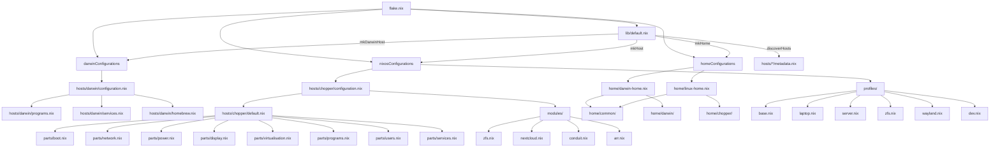

# Unified Nix Flake: macOS (nix-darwin) + NixOS

A single [Nix flake](https://nixos.wiki/wiki/Flakes) managing both macOS
(via [nix-darwin](https://github.com/LnL7/nix-darwin)) and NixOS from one
repository. Declarative, reproducible system configurations for every machine.

## Features

- **Single flake, multiple systems** — macOS and NixOS hosts share inputs,
  overlays, and Home Manager modules.
- **macOS support** — `nix-darwin` system configuration with Homebrew
  integration via `nix-homebrew`.
- **NixOS + ZFS** — `chopper` laptop runs NixOS with ZFS root provisioned
  by [disko](https://github.com/nix-community/disko).
- **Home Manager** — per-user environment for both platforms, usable
  standalone or integrated into the system rebuild.
- **Neovim** — configured via [nixvim](https://github.com/nix-community/nixvim).
- **Rust toolchain** — nightly Rust via [fenix](https://github.com/nix-community/fenix).

### Planned / in-progress

- [ ] **Secrets management** — [sops-nix](https://github.com/Mic92/sops-nix)
  is in the flake inputs but not yet wired up. Secrets currently live at
  plaintext paths under `/home/vysakh/`.
- [ ] **CI** — `nix flake check` in GitHub Actions.
- [ ] **treefmt** — unified formatting (currently `nixpkgs-fmt` via `nix fmt`).

## Repository Structure

```
.
├── flake.nix                  # Flake entrypoint: inputs, outputs, host configs
├── flake.lock
├── CLAUDE.md                  # Audit notes & improvement checklist
├── ROADMAP.md                 # Milestone plan
├── CONTRIBUTING.md            # Contributor guide
│
├── hosts/
│   ├── darwin/                # macOS — "Vysakhs-MacBook-Pro"
│   │   ├── configuration.nix  #   system-level nix-darwin config
│   │   ├── programs.nix       #   GUI / CLI programs
│   │   ├── services.nix       #   launchd / background services
│   │   └── NVIM.md            #   Neovim notes
│   └── chopper/               # NixOS — "chopper" laptop
│       ├── configuration.nix  #   NixOS entry (imports default.nix)
│       ├── default.nix        #   bulk of host config
│       ├── disko-config.nix   #   ZFS partition layout
│       └── hardware-configuration.nix
│
├── home/                      # Home Manager configurations
│   ├── darwin-home.nix        #   HM entry point for macOS
│   ├── linux-home.nix         #   HM entry point for NixOS
│   ├── common/                #   cross-platform HM modules
│   ├── darwin/                #   mac-only HM modules
│   └── chopper/               #   chopper-only HM modules
│
├── modules/                   # NixOS service modules
│   ├── arr.nix                #   *arr media stack
│   ├── care.nix               #   care service
│   ├── conduit.nix            #   Conduit / conduwuit Matrix homeserver
│   ├── garage.nix             #   Garage S3-compatible storage
│   ├── neondb.nix             #   NeonDB wrapper
│   ├── nextcloud.nix          #   Nextcloud server
│   └── zfs.nix                #   ZFS maintenance / scrub config
│
└── packages/                  # Custom packages & overlays
    ├── default.nix
    ├── chopper/               #   packages for chopper
    ├── darwin/                #   packages for macOS
    └── neondb/                #   NeonDB derivation
```

## Module Composition



## Hosts

| Host | System | Manager | Description |
|---|---|---|---|
| `Vysakhs-MacBook-Pro` | `aarch64-darwin` | nix-darwin | MacBook Pro (Apple Silicon) |
| `chopper` | `x86_64-linux` | NixOS | Laptop, ZFS root via disko |

Home Manager targets:

| Target | Platform |
|---|---|
| `mathewalex@Vysakhs-MacBook-Pro` | macOS |
| `vysakh@chopper` | NixOS |

## Usage

### Rebuild the system

```sh
# macOS (nix-darwin)
nh darwin switch .

# NixOS
nh os switch .
```

### Standalone Home Manager

```sh
# macOS
home-manager switch --flake .#mathewalex@Vysakhs-MacBook-Pro

# NixOS
home-manager switch --flake .#vysakh@chopper
```

### Other common commands

```sh
# Update all flake inputs
nix flake update

# Format nix files
nix fmt

# Search packages
nix search nixpkgs <package-name>

# Check flake evaluation
nix flake check
```

## Customization

- **Add a host** — create `hosts/<name>/` with a `configuration.nix` (and
  optionally `default.nix`, `hardware-configuration.nix`, etc.), then wire
  it into `flake.nix`. See `CONTRIBUTING.md` for more detail.
- **Add a Home Manager module** — create a directory under `home/common/`
  (cross-platform) or `home/<host>/` (host-specific) with a `default.nix`,
  then import it from the relevant entry point.
- **Add a NixOS service** — create `modules/<service>.nix` and import it
  from the host that needs it.
- **Add a package** — add it under `packages/` and expose via the overlay
  in `packages/default.nix`.

## Key Inputs

| Input | Purpose |
|---|---|
| [nixpkgs](https://github.com/NixOS/nixpkgs) (unstable) | Package set |
| [home-manager](https://github.com/nix-community/home-manager) | User environment |
| [nix-darwin](https://github.com/LnL7/nix-darwin) | macOS system config |
| [nix-homebrew](https://github.com/zhaofengli-wip/nix-homebrew) | Homebrew cask integration |
| [fenix](https://github.com/nix-community/fenix) | Nightly Rust toolchain |
| [nixvim](https://github.com/nix-community/nixvim) | Neovim configuration |
| [disko](https://github.com/nix-community/disko) | Declarative disk partitioning |
| [sops-nix](https://github.com/Mic92/sops-nix) | Secrets management (planned) |
| [nix-index-database](https://github.com/nix-community/nix-index-database) | command-not-found index |

## Resources

- [NixOS Manual](https://nixos.org/manual/nixos/stable/)
- [nix-darwin Manual](https://daiderd.com/nix-darwin/manual/index.html)
- [Home Manager Manual](https://nix-community.github.io/home-manager/)
- [Disko docs](https://github.com/nix-community/disko)
- [Nix Flakes wiki](https://nixos.wiki/wiki/Flakes)

## License

See [LICENSE](LICENSE) for details.
