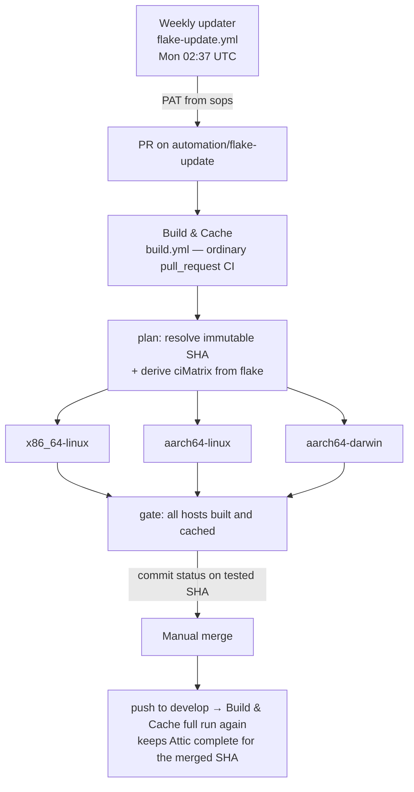

# CI: Flake update + binary cache pipeline

How `develop` stays deployable and why no host should ever compile a
package locally. This replaces the broken monolithic flake-update
workflow analyzed in `flake-update-strategy.md`.

## Architecture



Three workflows, one composite action:

| File | Role |
|---|---|
| `.github/workflows/flake-update.yml` | Weekly `nix flake update` → one PR. Nothing else. |
| `.github/workflows/build.yml` | Build & Cache: the real gate. Runs per-PR/per-push. |
| `.github/workflows/check.yml` | Lint/eval only (statix, deadnix, fmt). |
| `.github/actions/attic-setup` | attic-client (pinned via `--inputs-from .`) + login from sops. |

## Modes of Build & Cache

| Trigger | Mode |
|---|---|
| `push` to `develop` (nix paths) | **full** — build + push + verify |
| PR from `automation/flake-update` | **full** |
| `/build` comment on any PR (write access) | **full**, against the PR head SHA |
| any other PR touching nix paths | **eval** — `nix build --dry-run` only |

Full mode per architecture:

1. Checkout the single SHA resolved by `plan` (immutable for the whole run —
   re-runs after a branch update cannot mix results across candidates).
2. Nix installed with the production substituter set (Attic public ingress,
   cache.nixos.org, nix-community) **before** any build.
   No Magic Nix Cache.
3. Build every `ciMatrix` target for that arch once, collecting root paths.
4. `attic push` the roots (closures included), 4 attempts with backoff.
   A failed push fails the job. Never `|| true`.
5. **Verify:** realize every root into a fresh store (`--store`, `--max-jobs 0`)
   from the production substituters only. If this passes, deployment hosts
   can substitute everything — zero local compilation.

The `all hosts built and cached` gate only exists for full runs, fails on any
non-success, and publishes a commit status with that name on the tested SHA.

## Host inventory (`ciMatrix`)

`nix eval .#ciMatrix --json` returns arch-grouped targets derived from the
same `hosts/*` auto-discovery that produces `nixosConfigurations` /
`darwinConfigurations`, plus every real `homeConfigurations` attribute.
Adding a host directory automatically adds it to CI. The `plan` job
additionally cross-checks that every declared configuration appears in the
matrix and fails otherwise. Runner mapping lives in `lib/default.nix`
(`mkCiMatrix.runnerFor`).

## Update lifecycle

- The updater runs weekly and maintains **one** grouped PR.
- **Freeze-when-green:** if the open PR's head already has a successful
  `all hosts built and cached` status, the cron exits without touching the
  branch. A ready-to-merge candidate is never replaced by the timer.
  Override with the `force_update` dispatch input.
- **Merging is manual.** Merge when the gate is green. The subsequent
  `push` run re-pushes/verifies the merged SHA.
- Transient failure? Re-run the **whole** workflow from the Actions UI —
  never "re-run failed jobs" after the branch has moved (the plan SHA makes
  stale re-runs harmless, but a full re-run tests the current candidate).
- To bisect a breaking input, run `nix flake update <input>` locally and push
  a branch, then comment `/build` on its PR.
- Intentionally pinned inputs (`nixpkgs-signal`, `nixpkgs-entire`, Homebrew
  pins, `nix-homebrew` rev) are simply carried along; `nix flake update`
  respects URL pins.

## Secrets

| Secret | Where | Used by |
|---|---|---|
| `SOPS_AGE_KEY` | GitHub Actions secret | decrypting `secrets/ci/actions.yaml` in CI |
| `attic_token` | `secrets/ci/actions.yaml` (sops) | `attic login` before pushes. JWT: `r+w+cc` on `system`, expires 2036 |
| `github_pat` | `secrets/ci/actions.yaml` (sops) | the updater's PR creation — **must exist** (see below) |

### One-time setup: `github_pat`

PRs created with the default `GITHUB_TOKEN` do **not** trigger
`pull_request` workflows, so the updater needs a PAT:

1. Create a fine-grained PAT for this repository with **Contents:
   read/write** and **Pull requests: read/write**.
2. Add it to the sops file:

   ```sh
   sops set secrets/ci/actions.yaml '["github_pat"]' '"github_pat_XXXX..."'
   ```

3. Commit the re-encrypted file.

## Attic server notes (k8s)

- Image pinned by digest in `k8s/clusters/glug-infra/attic/{deployment,gc-cronjob}.yaml`.
  Update both together, deliberately.
- GC runs server-side: the CronJob executes
  `atticd --mode garbage-collector-once` with the rendered `server.toml`
  (the old client-JWT approach never worked). Failed GC jobs are retained
  for 7 days.
- Retention: 14 days (`config.yaml` `default-retention-period`). The
  contract is *"recent artifacts are opportunistically cached"* — the
  layered verify step also accepts cache.nixos.org/nix-community, so Attic
  GC can never break deployability of a merged SHA that upstream still
  serves.

## Future hardening (deliberately not enabled yet)

- `develop` ruleset requiring the `all hosts built and cached` status +
  GitHub auto-merge. Enable after a few clean weekly cycles.
- Renovate for action SHA pins and the Attic image digest.
