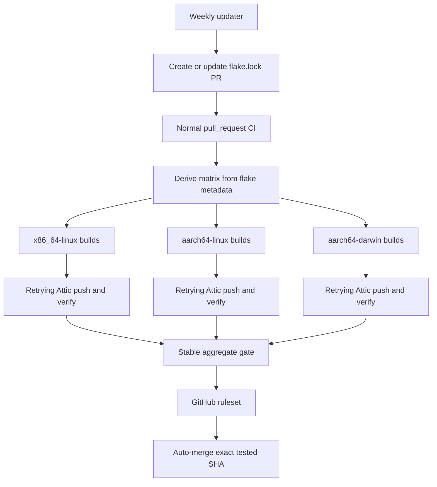

# Executive verdict

The current workflow is not safely maintaining or caching the flake:

- The last successful workflow was **June 15, 2026**.
- Of the latest 59 runs: **10 succeeded, 34 failed, 15 were cancelled**.
- PR [#34](https://github.com/tellmeY18/retire.nix/pull/34) has been open since June 15 and has accumulated 24 failure comments.
- The Attic `system` cache currently contains **zero substitutable objects**.
- `develop` has **no branch protection or rulesets**, so GitHub does not enforce the claimed invariant.
- No files or cluster resources were changed during this investigation.

## What is failing now

Today’s run produced three independent failures:

| Job | Result | Actual failure |
|---|---|---|
| `aarch64-linux` | Build succeeded | Push died immediately: `ATTIC_SUBSTITUTER: unbound variable` |
| `aarch64-darwin` | Darwin system succeeded | Home Manager rejected unfree `copilot-language-server-1.527.1` |
| `x86_64-linux` | No host builds attempted | Magic Nix Cache reported FlakeHub authentication failure, followed by invalid OpenClaw store paths during `nix flake check --no-build` |

This is not primarily an Attic upload outage. The workflow often does not reach `attic push`.

# Problems in the current workflow

## Critical correctness problems

### 1. Every strict Attic push is guaranteed to fail

`ATTIC_SUBSTITUTER` is used throughout `.github/workflows/flake-update.yml`, but it is never defined.

The initial builds happen to tolerate this because their shell does not enable `nounset`. Every push block uses:

```sh
set -euo pipefail
```

and then expands:

```sh
$ATTIC_SUBSTITUTER
```

The result is the confirmed failure:

```text
ATTIC_SUBSTITUTER: unbound variable
```

This explains the ARM failure even when the host built successfully.

### 2. The workflow does not test the PR commit

The scheduled workflow is attached to the `develop` SHA. It creates or updates a PR and then checks out the mutable branch name `automation/flake-update`.

Consequences:

- GitHub records the jobs against `develop`, not against the PR head.
- PR #34 has no PR check rollup.
- GitHub cannot enforce those checks through branch protection.
- Each architecture job can theoretically check out a different SHA if the branch moves.
- “Re-run failed jobs” is unsafe after a later cron updates the branch:
  - previously successful jobs certified the old SHA;
  - the rerun can build the new SHA;
  - `finalize` combines those results.

The workflow needs ordinary `pull_request` CI tied to one immutable PR/merge SHA.

### 3. There is no branch protection

The repository currently has:

- no rulesets;
- no protection on `develop`;
- default workflow token permission of read, with PR approval allowed.

Therefore `gh pr merge --auto` has no GitHub-enforced required build/cache gate. The shell script in `finalize` is the only safeguard.

### 4. It does not build every current configuration

The checked-out flake defines these NixOS configurations:

- `chopper`
- `c3po`
- `kenobi`
- `r2d2`
- `yoda`
- `vm-test`

The update workflow builds only:

- `chopper`
- `c3po`
- `kenobi`

`r2d2` and `yoda` are real hosts but are only evaluated indirectly. `vm-test` is also not built.

Additionally, the workflow requests:

```text
homeConfigurations."vysakh@chopper"
```

but the current `flake.nix` only declares:

```text
homeConfigurations."mathewalex@Vysakhs-MacBook-Pro"
```

Once the workflow reaches that x86 Home Manager step against the current local flake, it should fail with a missing attribute.

A hard-coded matrix has drifted from the auto-discovered host inventory.

### 5. The manual `skip_cache` path can still auto-merge

When `skip_cache=true`:

- all cache setup and push steps are skipped;
- the architecture jobs still report success;
- `finalize` considers that sufficient to merge;
- the success comment incorrectly says everything was pushed to Attic.

That directly violates the stated invariant. Build-only mode must never be eligible for automatic merge.

## Cache integration problems

### 6. Attic is configured after the builds

`attic use` happens after each main build. Therefore Attic cannot accelerate those builds.

Before that point:

- `$ATTIC_SUBSTITUTER` expands to nothing;
- x86 uses Magic Nix Cache;
- ARM and Darwin only use their normal configured caches.

Attic read configuration should exist before evaluation/build. Authentication is only needed for writes because this cache is public.

### 7. Magic Nix Cache is currently harmful here

The x86 job uses `DeterminateSystems/magic-nix-cache-action@main`.

Today it reported:

```text
FlakeHub: cache initialized failed: Unauthenticated
```

despite the installer configuration attempting to disable FlakeHub. The action step still concluded successfully, after which Nix evaluation encountered invalid paths served through the cache proxy.

Magic Nix Cache and Attic overlap in purpose, both alter Nix cache configuration, and Magic Nix Cache is only enabled on one architecture. For a cache intended to serve deployments across runs and machines, Attic should be the single CI cache.

### 8. Previous green runs did not guarantee uploads

The June “successful” runs used:

```sh
attic push ... || true
```

Therefore those successes only proved that builds passed. Cache failures were explicitly swallowed.

The three store objects I tested from the last successful ARM/Darwin run all returned `404 NoSuchObject`.

### 9. Attic client and SOPS are unpinned

`.github/actions/attic-setup/action.yml` installs tools with:

```sh
nix profile install nixpkgs#attic-client
nix run nixpkgs#sops
```

Those use the runner’s moving `nixpkgs` registry, not this repository’s lock file. A flake update workflow should not depend on an unrelated changing package source.

Use the locked flake input, for example through `--inputs-from .`, or expose the client as a flake package/dev-shell tool.

### 10. The CI secret is excessively broad

The build receives `SOPS_AGE_KEY`, decrypts `secrets/ci/actions.yaml`, extracts an Attic token with `grep | awk`, writes plaintext to `/tmp`, and then removes it.

Problems:

- The age private key may decrypt more than the one Attic credential.
- The plaintext file normally inherits a permissive umask.
- A failure before `rm` leaves it until runner teardown.
- YAML parsing using `grep` and `awk` is brittle.
- All this protects a credential that GitHub Secrets can store directly.

Use a direct `ATTIC_TOKEN` GitHub secret containing a short-lived, push-only token scoped to `system`.

### 11. There are no upload retries or cache verification

Attic currently has no robust internal retry layer for all transport failures. A single transient proxy/R2 failure aborts the push.

A successful push also is not independently verified. For the strongest guarantee, realize each output root into a fresh store with local builds disabled and the same substituter set used by deployment hosts.

### 12. The cache-retention contract is unclear

The manifest claims 14-day retention. The database’s `cache.retention_period` for `system` is currently `NULL`; the server-level default may still apply, but this should be verified rather than inferred.

Even if 14 days is effective, a weekly update retains only about two generations. An unmodified machine offline for more than two weeks may miss custom binaries and rebuild them later.

Define whether the promise is:

1. “The latest merged generation remains deployable from Attic”, or
2. “Recent artifacts are opportunistically cached for 14 days.”

Those are different policies.

## Update lifecycle problems

### 13. One giant update has remained broken for two months

All inputs are updated into one continually rewritten PR. Independent problems accumulate:

- OpenClaw evaluation/store-path failure;
- Darwin unfree package policy;
- a previous Darwin `profanity` source 404;
- the Attic shell bug;
- Magic Nix Cache behavior.

Each cron replaces the PR candidate, making failures harder to reproduce while never advancing `develop`.

A grouped update remains the right default for CI cost, but it needs:

- immutable per-SHA checks;
- an input change summary;
- an option to freeze a failing candidate;
- a manual per-input diagnostic workflow.

### 14. `*/3` is not exactly every 72 hours

```yaml
cron: "0 6 */3 * *"
```

means selected days of each calendar month, not “every three days forever”. It also runs at the top of the hour, where GitHub says scheduled workflows are more likely to be delayed.

Weekly is more appropriate for a full native build of six NixOS configurations plus Darwin/Home Manager.

### 15. Mutable action references

These are moving targets:

- `DeterminateSystems/nix-installer-action@main`
- `DeterminateSystems/magic-nix-cache-action@main`

The live Magic Nix Cache behavior demonstrates the risk. Pin third-party actions to full commit SHAs and let Renovate update those pins separately.

### 16. The workflow has excessive permissions

Workflow-level permissions give all build jobs:

```yaml
contents: write
pull-requests: write
```

Build jobs only need `contents: read`. Only the updater needs contents/PR write, and only the merge action needs PR write.

### 17. Local and remote state differ

The local working copy is clean but is ahead of `develop@origin`. Scheduled Actions operate only on remote `develop`.

For example, local `flake.nix` now pins newer Homebrew inputs, while PR #34 is still based on the older remote definitions. CI cannot account for local-only fixes.

# Attic health check

All cluster commands explicitly used:

```sh
export KUBECONFIG=~/.kube/glug-infra.yaml
```

## Healthy components

- Kubernetes API reachable.
- `attic` deployment rolled out: `1/1`.
- Pod has been ready for 30 days.
- Service and EndpointSlices resolve to the pod.
- Public ingress works over verified HTTPS.
- Tailnet service works over HTTP on port 8080.
- `https://cache.tellmey.fyi/system/nix-cache-info` returns:

```text
WantMassQuery: 1
StoreDir: /nix/store
Priority: 41
```

- Current resource use is low: about `1m` CPU and `37Mi` memory.
- No recent Attic pod events.
- The three container restarts were all during initial startup 30 days ago.

The failed HTTPS call to `attic.tail477f2f.ts.net:8080` is expected: that service speaks plain HTTP on port 8080.

## Critical Attic findings

### The cache is currently empty

Direct read-only database counts:

| Table | Rows |
|---|---:|
| `cache` | 1 |
| `object` | **0** |
| `nar` | 7 |
| `chunk` | 1,766 |

`object = 0` means the `system` cache currently has no store paths that Nix can substitute. The old NAR/chunk rows appear to be historical or orphaned upload data.

So the endpoint is alive, but it is not presently serving cached build outputs.

### Garbage collection has never recorded success

The live CronJob has:

- `lastScheduleTime`: `2026-08-09T00:30:00Z`
- no `lastSuccessfulTime`
- no retained Job to inspect

The JWT generated by `gc-cronjob.yaml` is invalid for Attic authorization:

```json
{"scope":"delete"}
```

Attic requires the namespaced claim:

```json
{
  "https://jwt.attic.rs/v1": {
    "caches": {
      "system": {
        "d": 1
      }
    }
  }
}
```

The robust fix is not to hand-build the token. Use Attic’s own command against the same server configuration:

```sh
atticadm make-token \
  --sub gc-bot \
  --validity 1h \
  --delete system
```

Relevant files:

- `k8s/clusters/glug-infra/attic/gc-cronjob.yaml`
- [Attic token schema](https://github.com/zhaofengli/attic/blob/7a19204df10d606c5070e6bb72615c3461900c05/token/src/lib.rs)
- [Attic `make-token`](https://github.com/zhaofengli/attic/blob/7a19204df10d606c5070e6bb72615c3461900c05/server/src/adm/command/make_token.rs)

### Attic’s database dependency is degraded

CloudNativePG currently reports:

- phase: `Waiting for the instances to become active`
- ready: `1/2`
- current primary: `postgres-cluster-4`
- replica `postgres-cluster-10`: terminating for roughly 43 hours
- latest backup failed today
- `chopper`: `NotReady`

The surviving primary still serves Attic, but this is a single remaining database instance. Attic should not be treated as healthy enough for a cache-required merge gate until CNPG is restored to `2/2` and backups are green.

### Attic itself is also a single-host service

`attic` is:

- one replica;
- pinned to `kenobi`;
- backed by an HPA whose extra replicas would also run on `kenobi`.

The PDB prevents voluntary disruption but does not help if `kenobi` fails. This is acceptable for a performance cache if CI retries later, but not for a hard availability promise.

### Images are mutable

Both the deployment and GC CronJob use:

```yaml
ghcr.io/zhaofengli/attic:latest
```

A restart can silently introduce a different server/client/schema version. Pin a tested tag and preferably its digest.

# Ranked replacement strategies

## 1. Determinate updater + ordinary PR CI — recommended here

Use the Nix-specific [`DeterminateSystems/update-flake-lock`](https://github.com/DeterminateSystems/update-flake-lock) action only to create/update the lock PR. Authenticate it using a narrowly scoped GitHub App token so the resulting PR triggers normal `pull_request` CI.

Why this is the best fit:

- Smallest conceptual change from the current setup.
- Nix-specific and explicit.
- One grouped update PR keeps runner costs controlled.
- Ordinary PR checks are tied to the candidate SHA.
- GitHub branch rules, not a custom `finalize` shell script, control merging.
- No need to add a general dependency-management system solely for one lock file.

Caveats:

- It does not build, cache, or define merge policy; CI still must.
- Pin the action to a full SHA.
- A targeted input update can also refresh inputs whose lock reference is stale relative to `flake.nix`.
- Prefer a GitHub App over a user PAT.

## 2. Renovate Nix manager — best if you also want broader dependency automation

Renovate’s beta Nix manager supports:

- direct flake input updates;
- `flake.lock` maintenance;
- persistent branches;
- automatic rebasing;
- dependency dashboards;
- automerge after required checks.

This is already used by:

- [NixOS/infra](https://github.com/NixOS/infra/blob/main/renovate.json)
- [nix-community/colmena](https://github.com/nix-community/colmena/blob/main/renovate.json)
- `nix-community/nixos-facter`
- `nix-community/nix-github-actions`

Why it ranks second:

- Excellent failed-PR lifecycle.
- Its GitHub App naturally triggers normal CI.
- It can also pin/update GitHub Actions and container digests.

But:

- Nix support remains beta and opt-in.
- Per-input extraction covers direct root inputs, not every transitive lock node.
- Git-ref inputs lack meaningful release-age metadata.
- It is more machinery than needed if flake updates are the only target.

If you plan to use Renovate for GitHub Actions and Kubernetes image pins too, this option should move to rank one.

## 3. Repair the existing monolithic scheduled workflow

It could be made safe by:

- outputting the exact PR head SHA;
- checking out that exact SHA in all jobs;
- preventing branch mutation during a run;
- publishing a status/check against the PR head;
- verifying the PR head is unchanged before merge;
- deriving the host matrix;
- fixing cache setup and verification.

This avoids a GitHub App or Renovate, but it retains substantial custom state-machine logic. The current mixed-SHA rerun problem is easy to reintroduce.

## 4. One PR per flake input

Useful for diagnosis, not as the regular strategy.

Advantages:

- Immediate identification of the breaking input.
- Small lock diffs.

Disadvantages:

- Every PR must rebuild every host.
- PRs continually conflict or rebase against the same lock file.
- Coupled inputs often need to move together.
- ARM and macOS runner usage multiplies quickly.

Keep this as a manually dispatched troubleshooting mode.

# Recommended target architecture



# Detailed implementation plan

## Phase 0: repair the cache infrastructure first

1. Restore CNPG to `2/2` healthy instances.
2. Resolve the stuck `postgres-cluster-10` termination.
3. Confirm the latest CNPG backup succeeds.
4. Replace the handcrafted GC JWT with `atticadm make-token --delete system`.
5. Retain failed GC Jobs long enough to diagnose them—at least seven days.
6. Run one controlled GC and require `lastSuccessfulTime` to appear.
7. Confirm whether `NULL` cache retention uses the server default; set the cache retention explicitly if needed.
8. Pin the Attic deployment and CronJob image.
9. Create a dedicated Attic CI token:
   - cache pattern exactly `system`;
   - push permission only;
   - no create/configure/delete/destroy rights;
   - finite expiry;
   - store directly as `ATTIC_TOKEN` in GitHub Secrets.
10. Perform one synthetic upload and fresh read before depending on Attic in CI.

## Phase 1: establish an authoritative CI inventory

Expose a small `ciMatrix` flake output derived from host metadata. Each entry should provide:

- configuration name;
- system;
- runner;
- build attribute;
- whether it is deployable or test-only.

Expected current coverage:

- x86_64 Linux: `chopper`, `c3po`, `r2d2`, `yoda`, `vm-test`
- aarch64 Linux: `kenobi`
- aarch64 Darwin: `Vysakhs-MacBook-Pro`
- Home Manager: only attributes that actually exist in `homeConfigurations`

The matrix generator must fail if:

- the matrix is empty;
- a system lacks a runner;
- two entries have the same name;
- a NixOS/Darwin configuration is present but absent from CI.

The [arsfeld/nixos workflow](https://github.com/arsfeld/nixos/blob/master/.github/workflows/build.yml) is a particularly good real-world example of deriving and validating a host matrix.

## Phase 2: split updater from validator

Create a tiny updater workflow that only:

1. runs weekly at a non-round time, such as Monday `02:37 UTC`;
2. supports `workflow_dispatch`;
3. installs pinned Nix;
4. runs the pinned update action;
5. creates or updates one PR using a GitHub App installation token;
6. includes an old/new input revision summary in the PR body.

Do not build or merge in this workflow.

A persistent branch is fine because every branch update creates a new PR SHA and resets the required checks.

## Phase 3: make normal PR CI the build/cache gate

Trigger validation on:

- `pull_request` targeting `develop`;
- `merge_group` if merge queue is enabled;
- optionally `workflow_dispatch` for diagnostics.

For each architecture:

1. Check out the PR merge SHA.
2. Install pinned Nix.
3. Configure Attic as a public substituter before evaluation:
   - URL;
   - signing key;
   - `fallback = true`;
   - connection timeout;
   - download retries.
4. Do not use Magic Nix Cache in the same job.
5. Run evaluation/lint checks.
6. Build every matrix root with:

   ```sh
   nix build --no-link --print-out-paths
   ```

7. Save the returned roots once; do not run the same builds again merely to rediscover output paths.
8. Authenticate with the direct `ATTIC_TOKEN`.
9. Push explicit roots. `attic push` recursively pushes their runtime closures.
10. Retry the complete push three or four times with backoff and low concurrency.
11. Fail after retries—never use `|| true`.
12. Verify each root can be substituted.

For deployment correctness, explicit root pushes are preferable to relying only on `attic watch-store`. A watcher is useful for concurrent upload of intermediate paths, but it lacks a strong flush-on-exit guarantee. If used, still finish with a foreground explicit push.

## Phase 4: verify cache completeness

Decide which guarantee is required.

### Recommended layered-cache guarantee

Production can use:

1. Attic;
2. `cache.nixos.org`;
3. Garnix/upstream caches.

After pushing, create a fresh temporary store and realize every root with:

- the production substituter set;
- local builds disabled with `max-jobs = 0`;
- signature verification enabled.

This proves that the merged deployment can be obtained from the cache set without compiling.

### Standalone-Attic guarantee

If Attic alone must hold every closure path:

- push with `--ignore-upstream-cache-filter`;
- verify using only Attic.

This will consume substantially more R2 storage and conflicts with the current 10GB/14-day design. I do not recommend it unless deployment hosts cannot reliably reach upstream caches.

## Phase 5: add one stable required gate

Add an aggregate job with a permanent name such as:

```text
Flake update / all hosts built and cached
```

It must:

- use `if: always()`;
- inspect every matrix/build result;
- fail on `failure`, `cancelled`, or unexpected `skipped`;
- fail if zero matrix rows were built;
- fail if cache verification was disabled;
- succeed only when every architecture built, pushed, and verified.

Only this stable aggregate check needs to be required by the ruleset.

## Phase 6: protect `develop`

Create a GitHub ruleset that:

- requires pull requests;
- requires the aggregate all-host/cache check;
- requires the branch to be current with `develop`;
- blocks force pushes and branch deletion;
- does not give the updater bypass permission;
- optionally uses merge queue;
- allows GitHub auto-merge only after requirements pass.

The updater should request auto-merge; it should not perform an unrestricted `gh pr merge` itself.

## Phase 7: handle failed grouped updates

Keep one grouped weekly PR by default. When it fails:

1. Preserve all logs and the exact failed SHA.
2. Put changed input revisions in the workflow summary.
3. Do not use “re-run failed jobs” after the branch SHA changes.
4. Re-run the whole PR workflow for transient failures.
5. Use a manually dispatched input-specific workflow to identify the breaking input.
6. Apply a `freeze-update`/Renovate `stop-updating` label when you need the candidate to stop moving during investigation.
7. Keep intentionally fixed inputs excluded from automation:
   - `nixpkgs-signal`
   - `nixpkgs-entire`
   - pinned Homebrew references
8. Consider separate PRs only for repeatedly high-risk independent inputs such as `nix-openclaw` or `nixvim`.

## Phase 8: rollout safely

1. Repair Attic GC and CNPG first.
2. Add the new validator without auto-merge.
3. Run it manually against a fresh update candidate.
4. Confirm every declared configuration appears in the matrix.
5. Confirm Attic `object` count increases.
6. Confirm every root returns a valid narinfo.
7. Confirm fresh-store realization succeeds.
8. Add the `develop` ruleset.
9. Manually merge the first successful update.
10. Observe one more weekly cycle.
11. Only then enable automatic merge.

# Acceptance criteria

The strategy is complete when all of these are true:

- A flake update creates an ordinary PR check suite attached to its SHA.
- A later branch update cannot reuse an older architecture success.
- All six current NixOS configurations are evaluated and intentionally built or classified.
- Darwin and every declared Home Manager output are built natively.
- No workflow references nonexistent output attributes.
- Attic is configured before builds.
- No Magic Nix Cache is active in Attic build jobs.
- A failed Attic push prevents merge.
- Cache-skipped/manual validation cannot auto-merge.
- Every cached root is fresh-store realizable with the production substituters.
- The aggregate check is required by a `develop` ruleset.
- Attic GC has a recent successful run.
- CNPG is ready at its declared replica count.
- The latest CNPG backup is successful.
- CI receives only a scoped Attic token, not the general SOPS age key.
- Third-party actions and Attic images are pinned.

# Relevant sources

- [GitHub workflow-trigger token behavior](https://docs.github.com/en/actions/how-tos/writing-workflows/choosing-when-your-workflow-runs/triggering-a-workflow)
- [Determinate `update-flake-lock`](https://github.com/DeterminateSystems/update-flake-lock)
- [Renovate Nix manager](https://docs.renovatebot.com/modules/manager/nix/)
- [Renovate lock-file maintenance](https://docs.renovatebot.com/configuration-options/#lockfilemaintenance)
- [NixOS/infra Renovate configuration](https://github.com/NixOS/infra/blob/main/renovate.json)
- [NixOS/infra native architecture CI](https://github.com/NixOS/infra/blob/main/.github/workflows/ci.yml)
- [arsfeld/nixos matrix and retrying Attic push](https://github.com/arsfeld/nixos/blob/master/.github/workflows/build.yml)
- [Attic’s explicit-root push pattern](https://github.com/zhaofengli/attic/blob/main/.github/workflows/build.yml)
- [Attic token schema](https://github.com/zhaofengli/attic/blob/7a19204df10d606c5070e6bb72615c3461900c05/token/src/lib.rs)
